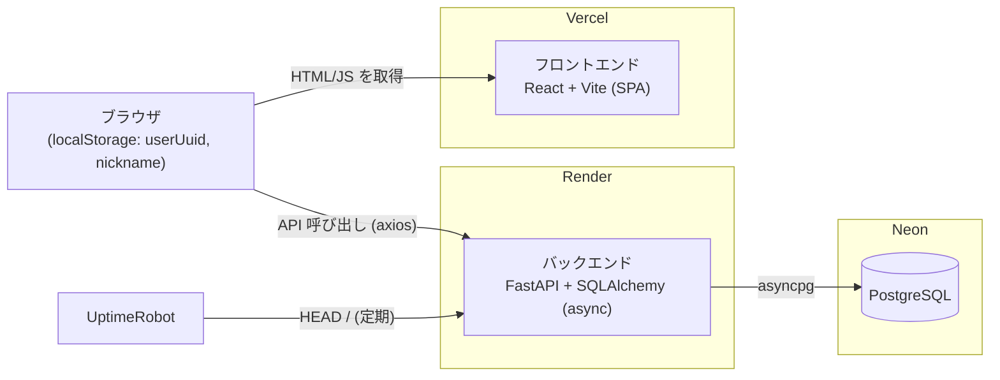
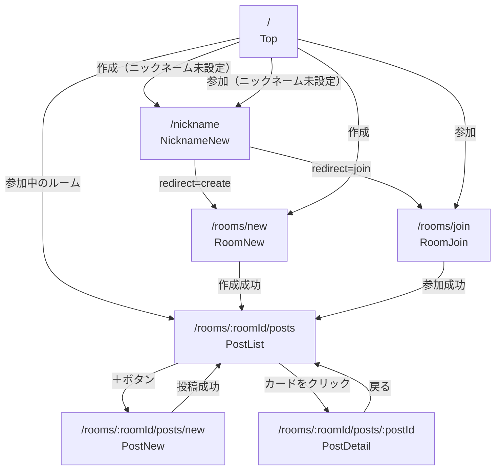
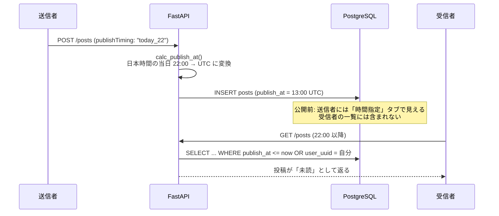

# アーキテクチャ

## システム構成



| 層 | 技術 | ホスティング | 主なファイル |
|---|---|---|---|
| フロントエンド | React 19, React Router 7, axios, CSS Modules | Vercel | `frontend/src/` |
| バックエンド | FastAPI, SQLAlchemy 2.0（非同期）, Pydantic | Render（`backend/render.yaml`） | `backend/app/` |
| データベース | PostgreSQL | Neon | — |

- フロントエンドはビルド済みの静的ファイルとして配信され、ブラウザから直接バックエンドの API を呼びます（接続先はビルド時の `VITE_API_BASE_URL`）
- バックエンドは CORS を設定し、別ドメインのフロントエンドからのリクエストを受け付けています
- UptimeRobot は、Render の無料プランがアクセスのない時にスリープするのを防ぐため、定期的に `HEAD /` を送っています

## ディレクトリ構成と役割

```
backend/app/
├─ main.py         FastAPI アプリ本体。CORS 設定・起動時のテーブル作成・ルーターの登録
├─ database.py     DB 接続（エンジン・セッション）。get_db() が 1 リクエストごとにセッションを渡す
├─ models.py       テーブル定義（SQLAlchemy モデル）
└─ routers/
   ├─ rooms.py     ルームの作成・参加・一覧
   └─ posts.py     投稿の作成・一覧・詳細（既読登録）・削除、公開日時の計算

frontend/src/
├─ main.jsx        React のマウント
├─ App.jsx         ルーティング定義（URL と画面の対応）
├─ api/client.js   API 呼び出し関数（axios）。バックエンドとの通信はすべてここを経由
├─ pages/          画面ごとのコンポーネント（JSX + CSS Module）
└─ components/     複数画面で使う部品（ReadCard: 既読の手紙 / EnvelopeCard: 未開封の封筒）
```

バックエンドの 1 リクエストの流れ:

```
HTTP リクエスト
  → routers/*.py のエンドポイント関数
      - Pydantic モデル（〇〇Request）でリクエスト JSON を検証
      - Depends(get_db) で DB セッションを受け取る
      - SQLAlchemy の select() などで DB を読み書き
  → Pydantic モデル（〇〇Response）に詰めて JSON で返す
```

## 画面遷移



## ユーザーの識別

このアプリには会員登録・ログインがありません。代わりに次の仕組みでユーザーを区別しています。

1. ニックネーム入力画面（`NicknameNew.jsx`）で、`crypto.randomUUID()` により UUID を生成
2. `userUuid` と `nickname` をブラウザの `localStorage` に保存
3. 以降の API 呼び出しでは、この `userUuid` をリクエストボディまたはクエリパラメータ（`?userUuid=...`）で送る
4. バックエンドは受け取った `userUuid` を使って「自分の投稿か」「既読か」「メンバーか」を判断する

このため:

- ブラウザ（や端末）が変わると別のユーザーとして扱われます
- ブラウザのデータを消すと、参加していたルームや自分の投稿との紐付けが失われます

## 主要なロジック

### 公開予約（時間差で届ける仕組み）



ポイント:

- 「公開済み」フラグは DB に保存しておらず、**一覧取得のたびに `publish_at` と現在時刻を比べて判断** しています
- そのため、公開時刻になっても通知などは飛ばず、受信者が一覧を開いた（再読み込みした）時点で見えるようになります
- 日時はすべて UTC で扱い、日本時間への変換は「公開タイミングの計算」と「フロントエンドでの表示」の 2 か所だけです

### 既読・未読

- 既読状態は `post_reads` テーブルに「誰がどの投稿を読んだか」を 1 行ずつ記録します
- 投稿詳細 API（`GET /posts/{postId}`）で **他人の投稿を開いた時点** で既読として記録されます
- 投稿一覧 API は、リクエストしたユーザーの既読記録をまとめて取得し、各投稿の `isRead` を計算します（自分の投稿は常に既読）
- 一覧画面（`PostList.jsx`）は、`isPublished` と `isRead`、投稿者が自分かどうかを組み合わせて「未読 / 既読 / 時間指定」の 3 タブに振り分けます。条件は [api.md](api.md#get-apiroomsroomidpostsuseruuid--投稿一覧) を参照してください

### 気分カラーと感情タグ

- 気分カラーは `red` / `blue` / `yellow` / `green` の 4 色で、DB には色名の文字列を保存します
- 実際の色コード（`#FF6B6B` など）や、色ごとの感情タグの候補は **フロントエンド側だけ** に定義されています（`PostNew.jsx` の `COLOR_TAGS`・`COLOR_HEX` など）
- 色コードの定義は `PostNew.jsx`・`ReadCard.jsx`・`EnvelopeCard.jsx` にそれぞれ書かれているため、色を変える場合は複数ファイルの修正が必要です

## テストと CI

- バックエンド: `backend/tests/`（pytest + FastAPI の TestClient、テスト用 PostgreSQL に接続）
- フロントエンド: `*.test.jsx`（vitest + Testing Library、API はモック）
- GitHub Actions（`.github/workflows/ci.yml`）が、`main` への push と PR ごとに Lint・テスト・ビルドを実行します

実行方法は [setup.md](setup.md#テストと-lint) を参照してください。
