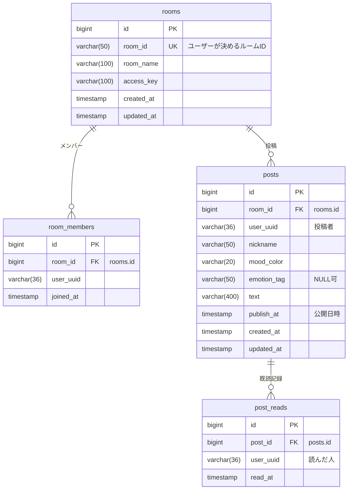

# データベース

本番は Neon（サーバーレス PostgreSQL）、ローカルは Docker の PostgreSQL を使います。
テーブル定義は `backend/app/models.py` に SQLAlchemy のモデルとして書かれています。

## ER 図



ユーザーを表すテーブルはありません。ユーザーは `user_uuid`（ブラウザで生成された UUID 文字列）だけで表されます。

## テーブル

`emotion_tag` 以外のカラムはすべて NOT NULL です。

> **日時カラムの初期値はアプリ側で入ります:** `created_at` などの初期値は SQLAlchemy の `default=datetime.utcnow`（Python 側）で設定しており、
> DB 側にはデフォルト値がありません。そのため Neon のコンソールなどで直接 `INSERT` する場合は、日時カラムも明示的に指定する必要があります。
> （ここに書いた定義は、空の DB に `create_all` した場合のものです。本番の DB が過去に手動で変更されていれば異なる可能性があります）

### `rooms` — ルーム

| カラム | 型 | 制約 | 説明 |
|---|---|---|---|
| `id` | BIGINT | PK, 自動採番 | 内部 ID。他テーブルからの外部キーはこちらを参照 |
| `room_id` | VARCHAR(50) | UNIQUE, NOT NULL | ユーザーが決める ID。URL（`/rooms/{roomId}/...`）に使われる |
| `room_name` | VARCHAR(100) | NOT NULL | 表示名 |
| `access_key` | VARCHAR(100) | NOT NULL | 参加時に照合する合言葉 |
| `created_at` / `updated_at` | TIMESTAMP | NOT NULL | 作成・更新日時（UTC） |

> **2 種類の「ルーム ID」に注意:** API やフロントエンドで `roomId` と呼んでいるのは `rooms.room_id`（文字列）です。
> 一方、`posts.room_id` と `room_members.room_id` は `rooms.id`（数値）を指します。
> API の中では、まず `room_id` 文字列でルームを検索し、得られた `id` を使って投稿などを検索しています。

### `room_members` — ルームの参加者

| カラム | 型 | 制約 | 説明 |
|---|---|---|---|
| `id` | BIGINT | PK | |
| `room_id` | BIGINT | FK → `rooms.id`, NOT NULL | |
| `user_uuid` | VARCHAR(36) | NOT NULL | 参加者 |
| `joined_at` | TIMESTAMP | NOT NULL | 参加日時（UTC） |

`(room_id, user_uuid)` に UNIQUE 制約（`uq_room_member`）があり、同じ人が同じルームに二重登録されることはありません。
Top 画面の「参加中のルーム」はこのテーブルから取得しています。

### `posts` — 投稿（手紙）

| カラム | 型 | 制約 | 説明 |
|---|---|---|---|
| `id` | BIGINT | PK | API の `postId` |
| `room_id` | BIGINT | FK → `rooms.id`, NOT NULL | |
| `user_uuid` | VARCHAR(36) | NOT NULL | 投稿者 |
| `nickname` | VARCHAR(50) | NOT NULL | 投稿時点のニックネーム（投稿ごとに保存） |
| `mood_color` | VARCHAR(20) | NOT NULL | `red` / `blue` / `yellow` / `green` |
| `emotion_tag` | VARCHAR(50) | NULL 可 | 感情タグ |
| `text` | VARCHAR(400) | NOT NULL | 本文 |
| `publish_at` | TIMESTAMP | NOT NULL | **公開日時**。これを過ぎると相手に見える |
| `created_at` / `updated_at` | TIMESTAMP | NOT NULL | 作成・更新日時（UTC） |

投稿を削除すると、関連する `post_reads` も SQLAlchemy の `cascade="all, delete-orphan"` によって一緒に削除されます
（DB 側の `ON DELETE CASCADE` ではなく、アプリ側の処理です）。

### `post_reads` — 既読記録

| カラム | 型 | 制約 | 説明 |
|---|---|---|---|
| `id` | BIGINT | PK | |
| `post_id` | BIGINT | FK → `posts.id`, NOT NULL | |
| `user_uuid` | VARCHAR(36) | NOT NULL | 読んだ人 |
| `read_at` | TIMESTAMP | NOT NULL | 既読になった日時（UTC） |

「行があれば既読、なければ未読」という単純な仕組みです。投稿詳細 API で他人の投稿を開いたときに 1 行追加されます。

## 日時の扱い

- DB には **タイムゾーン情報なしの UTC**（`TIMESTAMP WITHOUT TIME ZONE`）で保存しています
- 公開タイミング（「今夜 22:00」など）は日本時間で計算し、UTC に変換してから `publish_at` に保存します（`posts.py` の `calc_publish_at`）
  - 例: 日本時間 4/1 22:00 → `2026-04-01 13:00:00`
- 「公開済みかどうか」は保存されておらず、API が呼ばれるたびに `publish_at <= 現在時刻（UTC）` で判定しています。そのため、予約投稿を公開するためのバッチ処理などはありません
- Neon のコンソールなどで直接 SQL を実行して確認するときは、**表示される時刻が日本時間より 9 時間遅れている**ことに注意してください

## テーブルの作成とスキーマ変更

テーブルは、バックエンドの起動時に `Base.metadata.create_all` で作成されます（`app/main.py`）。

`create_all` は **存在しないテーブルを作るだけ** です。すでにあるテーブルに対しては何もしません。
そのため、`models.py` でカラムを追加・変更しても、既存の DB（本番の Neon を含む）には **自動では反映されません**。
スキーマを変更する場合は、Neon のコンソールなどで `ALTER TABLE` を手動で実行する必要があります。

```sql
-- 例: posts にカラムを追加する場合
ALTER TABLE posts ADD COLUMN example VARCHAR(50);
```

## 便利な SQL

```sql
-- ルームごとの投稿数
SELECT r.room_id, r.room_name, COUNT(p.id) AS posts
FROM rooms r LEFT JOIN posts p ON p.room_id = r.id
GROUP BY r.id ORDER BY posts DESC;

-- 公開待ちの投稿（日本時間で表示）
SELECT id, nickname, publish_at AT TIME ZONE 'UTC' AT TIME ZONE 'Asia/Tokyo' AS publish_at_jst
FROM posts WHERE publish_at > (NOW() AT TIME ZONE 'UTC');
```
